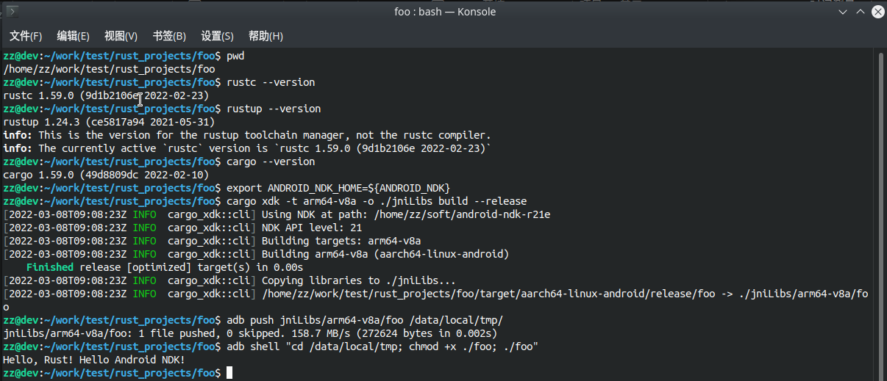

# Example for Rust Android Native Development

用 Rust 开发 Android 控制台应用程序的样板工程。

## 环境准备
安装 rust，确保 rustup, cargo 可用。

安装 Android NDK, 路径设为 `ANDROID_NDK_HOME` 环境变量。

添加 android 的 arm64 平台 target， 安装 cargo-xdk （桥接 Cargo 和 Android NDK； 注意 cargo-ndk 项目不支持编译为可执行程序）:
```bash
rustup target add aarch64-linux-android
cargo install cargo-xdk
```

## 创建项目
假设项目叫做 foo
```bash
cd ~/work/rust_projects
cargo new foo # 创建可执行程序为目标的工程，放在 foo 目录
cd foo
vim src/main.rs
```

## 编译运行
```bash
export ANDROID_NDK_HOME=${ANDROID_NDK}

# 默认的编译输出目录
cargo xdk -t arm64-v8a build --release
adb push target/aarch64-linux-android/release/foo
adb shell "cd /data/local/tmp; chmod +x ./foo; ./foo"

# 或者： 另行拷贝输出到 jniLibs 目录
cargo xdk -t arm64-v8a -o ./jniLibs build --release
adb push jniLibs/arm64-v8a/foo /data/local/tmp
adb shell "cd /data/local/tmp; chmod +x ./foo; ./foo"
```

## 截图


## References
- https://github.com/tiann/cargo-xdk